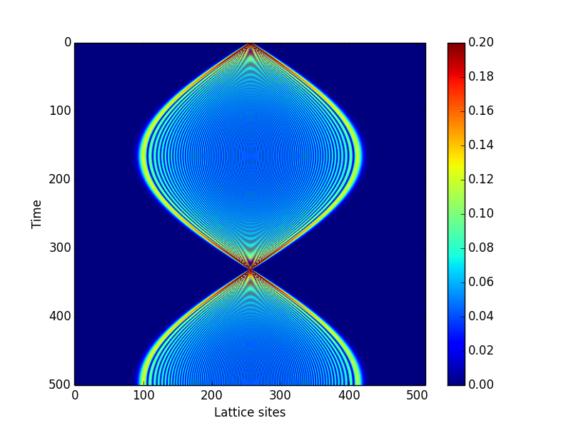

## PySciCal

PySciCal is a Scientific Calculator based on pylab.

### License

PySciCal is a free software released under GPLv3.

### Install

#### On Arch Linux
[AUR Package](https://aur.archlinux.org/packages.php?ID=56808)

#### Everywhere else (From Source)

    $ git clone git://github.com/yuyichao/pyscical.git
    $ cd pyscical
    $ mkdir -p build
    $ cmake ..
    $ make
    # make install

## OpenCL module

### Bloch Oscillation Simulation

